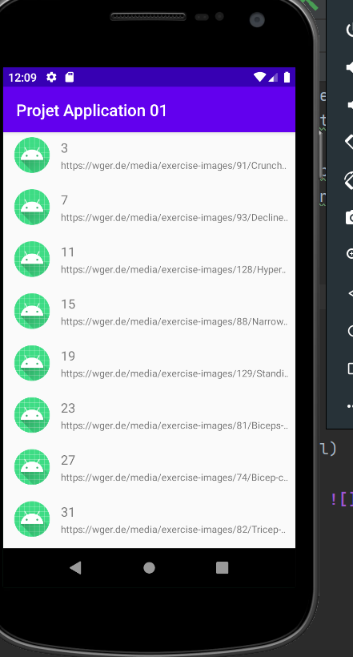
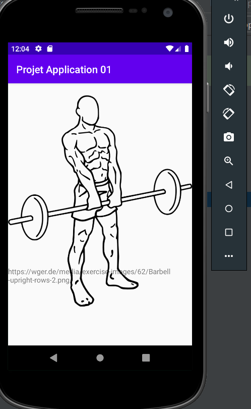
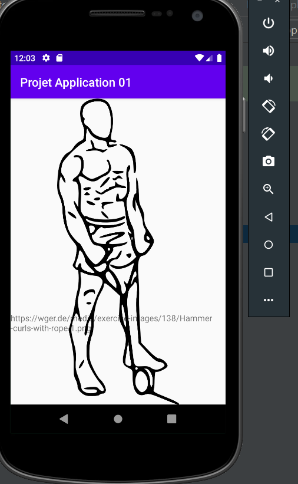

#
## Présentation :

Ce projet avait pour objectif d'Afficher une liste d'élément, de Récupérer des données via API reste et de stocker ses données dans notre application mobile
Cette application affiche les images de differents exercices selon l'identifiant donnée. Il utilise L'api du site Workout Manager : (https://wger.de).
Cette application permet d'aider une personne à exercer le mouvement d'un exercice.

Dans ce projet j'ai utiliser l'API PokeApi afin d'apprendre a comment utiliser le logiciel Android Studio, puis j'ai utilisé une autre API sur le workout.

## Logiciel à installer:

- Installation d'Android Studio

## Consigne respectées :

- Appel WebService à une API REST
- Affichage d'une liste dans un recyclerView
- Affichage du détail d'un item de la liste (string)
- Affichage du détail d'un item de la liste (image à partir d'une URL)
- 2 écrans : un pour la liste d'item, un autre pour l'affichage du détail
- Stockage de données en cache
- Archtecture en MVC, respectant principes SOLID. Avec Singleton et Design Patterns.
- Utilisation de Gitflow

## Fonctionnalités :
### Premier écran
- Liste de RecyclerView.

### deuxième écran
- Détail de l'élement
    
